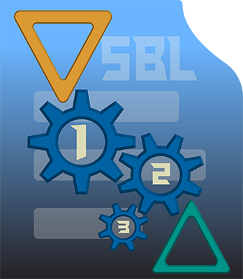

<!-- 

 -->

  

# SyncroBlitzLey

Sincroniza los nombres de los objetos seleccionados con los nombres de sus datos de malla en Blender.

## Características
- Sincronización del nombre del objeto con su malla de datos.
- Accesible desde la barra lateral en la Vista 3D.
- Compatible con Blender 2.80 o superior.

## Instalación
1. Descarga el archivo `.zip` del repositorio.
2. Abre Blender.
3. Ve a `Edit > Preferences > Add-ons`.
4. Haz clic en `Install` y selecciona el archivo `.zip`.
5. Activa el addon en la lista.

## Uso
1. Selecciona los objetos cuyos nombres quieras sincronizar.
2. Abre el menú lateral (`N`) en la Vista 3D.
3. Ve a la pestaña "SyncBzLey", cambia el nombre del objecto selectionado y haz clic en "Sync Selected Objects".

## Requisitos
- Blender 2.80 o superior.

## Licencia
Este addon está licenciado bajo la GNU General Public License v3.0 (GPLv3). Para más detalles, consulta el archivo `LICENSE`.

## Autor
Creado por AvpTankPowerJc.

Este proyecto está licenciado bajo la [GNU General Public License v3.0](https://www.gnu.org/licenses/gpl-3.0.txt).  
Eres libre de usar, modificar y distribuir este código siempre que los derivados mantengan esta misma licencia.